<h3>Nome: Vinícius de Oliveira Silva</h3>

<h3>Matrícula: 2013007820</h3>


<br/>
<br/><h4><b>Questão 1</b></h4>

Gerando a matriz <i>L</i>, e os vetores z e x 
```{r}
sigma <- matrix( c(4, 9, -14,
                  9, 30, -44,
                -14, -44, 94),
                 nrow=3,
                 ncol=3)

mu<-as.numeric(c(10,20,-50))

#Matriz L
L<-t(chol(sigma))

#vetor z
z <-rnorm(3, mean=0, sd=1)

#vetor x
x<-mu + L%*%z

```

Gerando uma amostra com 200 registros, calculando o vetor médio e comparando com o vetor esperado:

```{r}
amostra <- matrix(nrow = 200, ncol=3)
for(i in 1:200){
  amostra[i,] <- t(mu + L%*%rnorm(3, mean=0, sd=1))
}

vetorMedio <- apply(amostra, MARGIN = 2, FUN=mean)

print(vetorMedio)
```

Conforme podemos observar, o vetor medio é bastante proximo do vetor esperado µ.


Estimando a matriz de covariancia:
```{r}
getSij <-function(i,j,n,matriz){
  
  sum<-0
  for(counter in 1:ncol(matriz)){
    sum <- sum + (
                  (amostra[counter,i] - vetorMedio[i]) *
                  (amostra[counter,j] - vetorMedio[j])
                 )
  }
  
  return(sum/n)
}

#gerando a matriz S:
S <- matrix(nrow = 3, ncol = 3)

for(i in 1:3){
  for(j in 1:3){
    S[i,j] <- getSij(i,j,n=200,matriz=amostra)
  }
}
```

Se subtrairmos Σ de S, podemos ver com clareza o quanto elas são parecidas. 
```{r echo=FALSE}

print('Σ - S = ')
prmatrix(sigma - S, rowlab=rep("",3), collab=rep("",3))
```
Vemos que as diferenças entre a matriz estimada e a matriz geradora dos dados são bem pequenas.

Gerando a matriz de correlação ρ:
```{r}
origVariances <- diag(sigma)

rho <- matrix(nrow = 3, ncol = 3)

for(i in 1:3){
  for(j in 1:3){
    rho[i,j] <- sigma[i,j]/sqrt(origVariances[i] * origVariances[j])
  }
}

print('A matriz de correlação ρ é:')
prmatrix(rho, rowlab=rep("",3), collab=rep("",3))
```


Desejamos agora construir R, uma estimativa da matriz de correlação ρ:
```{r}
approxVariances <- diag(S)
R<- matrix(nrow = 3, ncol = 3)

for(i in 1:3){
  for(j in 1:3){
    R[i,j] <- S[i,j]/sqrt(approxVariances[i] * approxVariances[j])
  }
}

print('A matriz de correlação estimada R é:')
prmatrix(R, rowlab=rep("",3), collab=rep("",3))

```

Para compararmos as matrizes R e ρ, podemos olhar para o resultado da subtração das duas:
```{r echo=FALSE}

print('ρ - R = ')
prmatrix(rho - R, rowlab=rep("",3), collab=rep("",3))
```
Percebemos que as entradas da matriz resultante desta subtração são bastante pequenas, o que indica que as matrizes são bastante similares


<br/><h4><b>Questão 2</b></h4>
```{r}

R11 <- list()
R12 <- list()
R13 <- list()
R21 <- list()
R22 <- list()
R23 <- list()
R31 <- list()
R32 <- list()
R33 <- list()

amostraR <- list(R11, R12, R13, R21, R22, R23, R31, R32, R33)

#repetiremos a simulação 5000 vezes
for (counter in 1:5000){
  
  #gerando a matriz amostra
  for(i in 1:200){
    amostra[i,] <- t(mu + L%*%rnorm(3, mean=0, sd=1))
  }
  
  #matriz de correlacao empirica R
  R <- cor(amostra)
  
  amostraR[[1]] <- append(amostraR[[1]], R[1,1])
  amostraR[[2]] <- append(amostraR[[2]], R[1,2])
  amostraR[[3]] <- append(amostraR[[3]], R[1,3])
  amostraR[[4]] <- append(amostraR[[4]], R[2,1])
  amostraR[[5]] <- append(amostraR[[5]], R[2,2])
  amostraR[[6]] <- append(amostraR[[6]], R[2,3])
  amostraR[[7]] <- append(amostraR[[7]], R[3,1])
  amostraR[[8]] <- append(amostraR[[8]], R[3,2])
  amostraR[[9]] <- append(amostraR[[9]], R[3,3])
}

k<-1
for(i in 1:3){
  
  for(j in 1:3){
    
    #não precisamos calcular a correlação de uma variavel com ela mesma, pois esse valor é sempre 1
    "também não precisamos recalcular a correlação entre as variáveis i e j se i > j, uma vez que a correlação entre i e j é
    igual a correlação entre j e i"
    if(i<j){
      hist(as.numeric(amostraR[[k]]), main=paste("Histograma da correlação entre as variáveis ", i, " e ", j), xlab = "Valor da correlação")  
    }
      
    k<- k+1
  }
}

#transforma uma lista de listas em uma matriz (cada lista é uma coluna)
matrixAmostraR <-  (sapply (amostraR, function (x) {length (x) <- 5000; return (x)}))

#---------------------Obtendo a matriz R---------------------
myMean <- function(myArray){
  return (mean(as.numeric(myArray)))
}

matrixExpectedR <- matrix(apply(matrixAmostraR, MARGIN = 2,FUN = myMean), nrow = 3, ncol = 3)


#------------------------------------------------------------
```

A matriz R é portanto:
```{r}
prmatrix(matrixExpectedR, rowlab=rep("",3), collab=rep("",3))
```

Podemos ver que ela é bem parecida com a matriz rho:
```{r}
prmatrix(rho, rowlab=rep("",3), collab=rep("",3))
```

Podemos tambem calcular os DP de cada r<sub>ij</sub> da matriz R e montar uma nova matriz contendo esses desvios:

```{r}

dpMatrix <- matrix(nrow = 3, ncol = 3)

amostraRindex<-1
for (i in 1:3){
  for(j in 1:3){
    dpMatrix[i,j] <- sd(as.numeric(amostraR[[amostraRindex]]))  
    amostraRindex <- amostraRindex+1
  }
}

prmatrix(rho, rowlab=rep("",3), collab=rep("",3))
```
<br/><h4><b>Questão 3</b></h4>

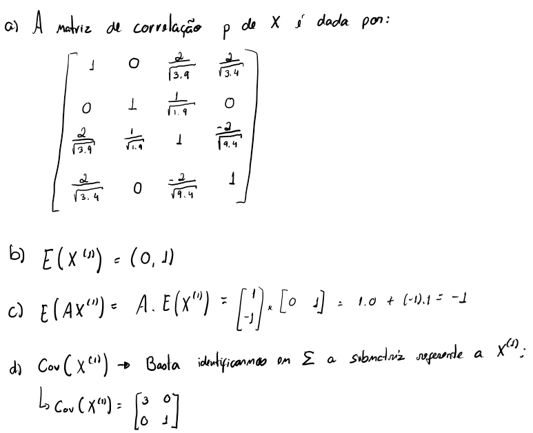</img>

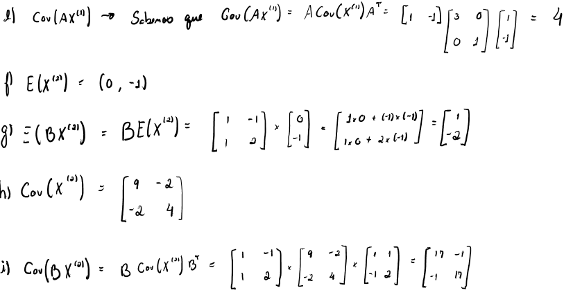</img>


<br/><h4><b>Questão 4</b></h4>

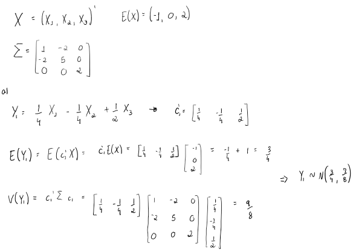</img>

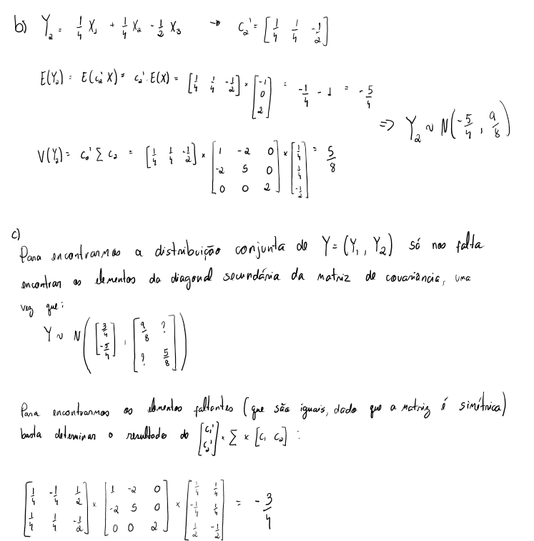</img>

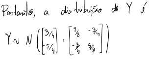</img>

<br/><h4><b>Questão 5</b></h4>

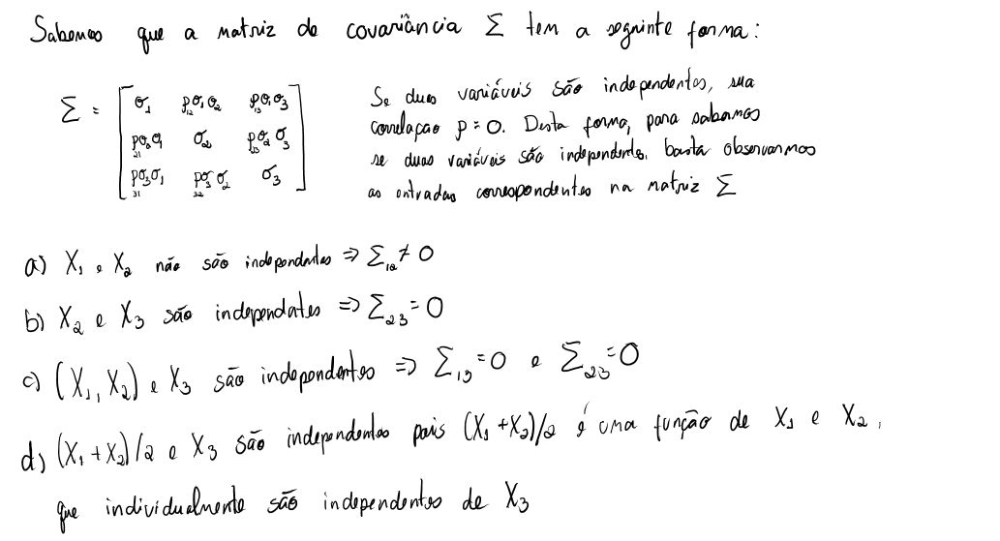</img>

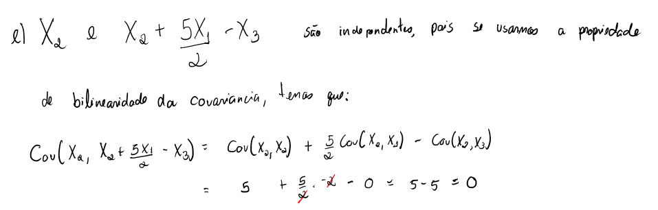</img>

<br/><h4><b>Questão 6</b></h4>

a) E(D<sup>2</sup>) = p --> dimensão do vetor X
b) √V(D<sup>2</sup>) = p --> dimensão do vetor X
c) D<sup>2</sup> ~ Quiquadrado com p graus de liberdade
d) Os eixos deste elipsoide são os autovetores da matriz de covariância de X. O comprimento desses eixos é proporcional aos autovalores associados
e)

```{r}
stiffness = matrix(scan("stiffness.txt"), ncol=5, byrow=T)

x <- stiffness[,1:4]

mu <- apply(x, MARGIN = 2, FUN=mean)

sigma <- cov(x)
```

O vetor esperado µ é:
```{r echo=FALSE}
print(mu)
```

A matriz de covariância Σ é:
```{r echo=FALSE}
prmatrix(sigma, rowlab=rep("",4), collab=rep("",4))
```

Encontrando os registros de stiffness que são considerados anomalias:
```{r}

anomalies <-mahalanobis(x, mu, sigma) > qchisq(0.95, 4)
n <-nrow(x)
nAnom <- sum(anomalies)
pairs(rbind(x, x[anomalies,]), pch="*", col=rep(c("black", "red"), c(n, nAnom)))

```

<br/><h4><b>Questão 7</b></h4>

```{r}

head(iris)

dim(iris)

pairs(iris[,1:4])

titulo = "Iris Data (red=setosa, green=versicolor, black=virginica)"
pairs(iris[,1:4],main=titulo, pch=21, bg = iris$Species)
```

Analisando a espécie setosa:
```{r}

setosa <- iris[iris$Species == "setosa", 1:4]
pairs(setosa) # plots de pares das 4 variaveis
mu <- apply(setosa, 2, mean) # media aritmetica de cada variavel
sigma <- cov(setosa) # estimativa da matriz de covariancia
rho <- cor(setosa) # estimativa da matriz de correlacao

```

a) As estimativas para µ, Σ e ρ são:

```{r echo=FALSE}

cat('µ≈\n ')
print(mu)

cat('\nΣ≈ ')
prmatrix(sigma, rowlab=rep("",4), collab=rep("",4))

cat('\nρ≈ ')
prmatrix(rho, rowlab=rep("",4), collab=rep("",4))
```

b) Analisando a matriz de correlação, vemos que as variáveis mais correlacionadas são o comprimento e a largura da sépala (ρ=0.74) e as variáveis menos correlacionadas são o comprimento da pétala e a largura da sépala.

c) Para determinarmos a distribuição marginal de <b>X*</b> = (X<sub>1</sub>, X<sub>2</sub>) basta observarmos as posições correspondentes no vetor esperado e na matriz de covariância de X.

<center> <b>X*</b> ~ 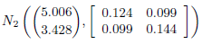</img> </center>

d) A distribuição condicional de <b>X*</b> quando X<sub>3</sub> = <i>x</i><sub>3</sub> e X<sub>4</sub> = <i>x</i><sub>4</sub> é da forma N<sub>2</sub>(<b>m</b>, <b>V</b>), onde:

<center> <b>m</b> 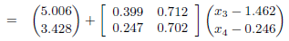</img> </center>

Conhecendo os valores de <i>x</i><sub>3</sub> = 1.8 e <i>x</i><sub>4</sub> = 0.6 temos:

```{r echo=FALSE}
cat('m = \n\t')
cat(c(5.393, 3.760), sep = '\n\t')
```

A matriz de covariância é dada por:

<center><b>V</b> </img></center>

<b>V</b> = 
```{r echo=FALSE}
V <- matrix(c(0.110, 0.088, 0.088, 0.134), nrow = 2, ncol = 2)
prmatrix(V, rowlab=rep("",4), collab=rep("",4))
```

e) Sabemos que a distribuição condicional de <b>X*</b> = (X<sub>1</sub>, X<sub>2</sub>)|X<sub>3</sub> = <i>x<sub>3</sub></i> continuará sendo uma normal multivariada da forma N<sub>2</sub>(<b>m</b>, <b>V</b>), onde precisamos encontrar <b>m</b> e <b>V</b>.
Utilizamos as fórmulas conhecidas, temos então:

<b>m</b> 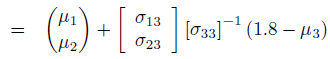</img>
<br/>
<b>m</b> 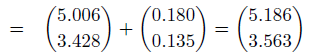</img>
<br/>

e 

<b>V</b> 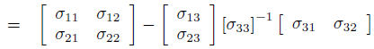</img> 
<br/>

<b>V</b> <br/> 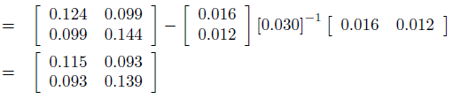</img>


f) Aplicando os mesmos procedimentos do item anterior, temos que:

<center><b>X*</b> ~ N<sub>2</sub>(<b>m</b>, <b>V</b>)</center>

onde <b>m</b> 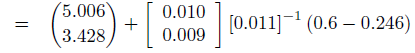</img>

<b>m</b> = 

```{r echo=FALSE}

mu <- matrix(c(5.328, 3.718), nrow = 2, ncol = 1)
prmatrix(mu, rowlab=rep("",2), collab=rep("",1))

```


e


<b>V</b> <br/> 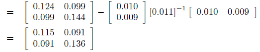</img>


g) Analisando os resultados anteriores, vemos que saber o valor de X<sub>4</sub> diminui mais a incerteza sobre o valor de X<sub>2</sub> do que conhecer o valor de X<sub>3</sub>. Desta forma, prefiro conhecer X<sub>4</sub> pois ela tem maior poder de influência sobre a variável X<sub>2</sub>. É importante observar que os valores específicos <i><x<sub>3</sub>/i> e <i><x<sub>4</sub>/i> não tem influência sobre as variâncias condicionais, o que faz com que seja melhor conhecer algum valor de X<sub>3</sub> do que de X<sub>4</sub> independentemente do número conhecido.

h) Comparando as variâncias condicionais quando conhecemos X<sub>3</sub> e X<sub>4</sub> temos:

V(X<sub>2</sub> | X<sub>3</sub>=1.8, X<sub>4</sub> = 0.6) = 0.134

V(X<sub>2</sub> | X<sub>4</sub> = 0.6) = 0.136

Vemos que adicionar informação sobre a variável X<sub>3</sub> reduz a variância de X<sub>2</sub> em apenas 0.002, quando o valor de X<sub>4</sub> é conhecido.


<br/><h4><b>Questão 8</b></h4>

a) Afirmativa Falsa, uma vez que se (<i>x<sub>1</sub></i> - μ<sub>1</sub>) / √σ<sub>11</sub> = 2) temos que μ<sub>c</sub> = μ<sub>2</sub> + 2ρ√σ<sub>22</sub>. Como |ρ| < 1, 2ρ√σ<sub>22</sub> < 2√σ<sub>22</sub>, ou seja, o valor esperado μ<sub>c</sub> não varia por mais de dois desvios-padrão.

b) a variancia condicional V(X<sub>2</sub> | X<sub>1</sub> = <i>x</i>) = σ<sub>c</sub><sup>2<sup> = σ<sub>22</sub>(1-ρ<sup>2<sup>), que independe de <i>x</i>

c) Verdadeiro, pois a variância de X<sub>2</sub> condicionada em X<sub>1</sub> é igual a σ<sub>22</sub>(1-ρ<sup>2</sup>) que é sempre menor que σ<sub>22</sub>, já que ρ<sup>2</sup> < 1.

d) Verdadeiro, pois temos que:

<center></img></center>

sabemos que µ<sub>2</sub> e ρ√(σ<sub>22</sub> / σ<sub>11</sub>) são constantes, o que significa que a equação encontrada para µ<sub>c</sub> é uma função linear de  <i>x</i><sub>1</sub> 