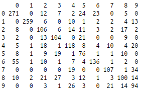
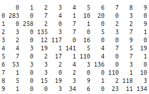
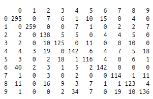
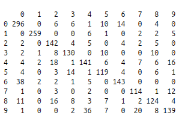
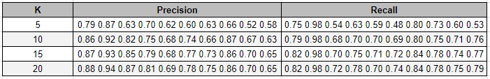

<h3>Nome: Vinícius de Oliveira Silva</h3>

<h3>Matrícula: 2013007820</h3>

<br/>
<br/><h4><b>Questão 2</b></h4>


<b>a)</b> Utilizando o código abaixo, podemos variar o valor da variável k para avaliar o desempenho do algoritmo utilizando diferentes quantidades de autovetores: 
```{r echo=FALSE}
library(imager)
```

```{r}


#Treinamento -> objetivo: encontrar os autovetores da matriz centralizada e os coeficientes médios para cada grupo de dígitos.

#------------------------------------------------------------------------
# leitura dos dados e remoção do label de classificação.
trainingData <- read.table("zip.train")
unclassifiedTraining <- t(trainingData[,-1])

#calculo da média dos dígitos
avg_digit <- apply(unclassifiedTraining, MARGIN = 1, FUN=mean)

#centralizando a matriz em torno do digito médio
centered_training_matrix <- unclassifiedTraining - avg_digit

#calculo do PCA propriamente dito
pca <- prcomp(t(centered_training_matrix))

#salvamos os autovalores e os autovetores
eigenvalues <- (pca$sdev)^2
eigenvectors <- (pca$rot)

#escolha do numero de componentes principais - Variamos este valor para avaliarmos o modelo
k<-15
usedPCAs <- eigenvectors[,1:k]

#encontramos os coeficientes W<i,j> de todas as imagens disponíveis no treinamento
coefTraining <- t(usedPCAs) %*% centered_training_matrix


#devemos agora montar uma matriz contendo os coeficientes médios para cada grupo.
#A matriz deve conter 10 colunas e k linhas, uma coluna para cada dígito e uma linha para cada coeficiente que multiplicará um autovetor utilizado.

#Primeiro devemos pesquisar na tabela os índices de todas as imagens de cada dígito para podermos computar a média de cada grupo:
trainingClassification <- trainingData[,1]
trainingClassificationIndexes <- list()

for(i in 0:9){
  trainingClassificationIndexes[[i+1]] <- which(trainingClassification==i)
}

#Computando a média, utilizando os índices que acabamos de encontrar
coefAvg <- matrix(ncol=10, nrow = k)
for (i in 0:9){
  coefAvg [, i+1]<- apply( coefTraining[, trainingClassificationIndexes[[i+1]] ], MARGIN=1, FUN=mean)
}

#                           Treinamento concluído
#------------------------------------------------------------------------


#Teste -> objetivo: decompor cada imagem de teste com os autovetores encontrados, computar o conjunto de coeficientes e verificar qual dentre os conjuntos de coeficientes médios conhecidos mais se aproxima dele.

#------------------------------------------------------------------------

#leitura dos dados e remoção dos labels de classificação
testData <- read.table("zip.test")
unclassifiedTest <- t(testData[,-1])

#centralização da matriz de teste
centered_test_matrix <- unclassifiedTest - avg_digit

#calculo dos coeficientes
coefTest <- t(usedPCAs) %*% centered_test_matrix

#extraímos os labels para verificarmos se acertamos ou não as nossas predições
testClassification <- testData[,1]

#Devemos agora procurar a coluna do vetor de coeficientes médios que mais se aproximam do coeficientes computados para esta amostra de teste. -> esta é a nossa predição
indproximo = numeric()

for(j in 1:ncol(coefTest)){
  indproximo[j] = which.min( apply((coefAvg - coefTest[,j])^2, 2, mean) ) - 1
}

#verificamos quantos acertos obtivemos dentre o nosso conjunto de teste

counterRight <- 0
for(i in 1:ncol(coefTest)){
  if(indproximo[i] == testClassification[i]){
    counterRight <- counterRight+1
  }
}

sprintf("Predição correta em %s%% dos casos.", format(round((counterRight/ncol(coefTest))*100, digits=2), nsmall = 2))
```

<br/>
<b>b)</b>

O código que gera a matriz de confusão é o seguinte:

```{r eval = FALSE}
confusion_matrix <- matrix(ncol = 10, nrow = 10)
for(i in 0:9){
  predictedI <- indproximo==i
  for(j in 0:9){
    confusion_matrix[i+1,j+1] <- sum(predictedI & (testClassification==j))
  }
}
prmatrix(confusion_matrix, rowlab=as.character(c(0:9)), collab=as.character(c(0:9)))
```

Variando o parâmetro K, temos as seguintes matrizes:

<center>
K=05:
</img>
<br/>


K=10:
</img>
<br/>


K=15:
</img>
<br/>


K=20:
</img>
<br/>
</center>

<b>c)</b>

Código para calcular a proporção:

```{r eval = FALSE}
diagonalSum <- sum(diag(confusion_matrix))
totalElements <- sum(confusion_matrix)
sprintf("A porcentagem de elementos na diagonal é: %s%% para k=%d", format(round((diagonalSum/totalElements)*100, digits=2), nsmall = 2), k)
```
<center>
A porcentagem de elementos na diagonal é: 68.31% para k=05;

A porcentagem de elementos na diagonal é: 76.83% para k=10;

A porcentagem de elementos na diagonal é: 79.22% para k=15;

A porcentagem de elementos na diagonal é: 80.07% para k=20;

Como esperado, a proporção é máxima para k=20.
</center>


<b>d)</b>

Código para computar a precisão:
```{r eval = FALSE}

rowSum <- apply(confusion_matrix, MARGIN = 1, FUN = sum)
precision <- round(diag(confusion_matrix)/rowSum, 2)
print(precision)
```

<br/>
Código para computar o recall:
```{r eval = FALSE}

columnSum <- apply(confusion_matrix, MARGIN = 2, FUN=sum)
recall <- round(diag(confusion_matrix)/columnSum, 2)
print(recall)
```


<center>
Executando esses códigos variando o K, podemos montar a seguinte tabela:

</img>
</center>

<br/>
<br/>
